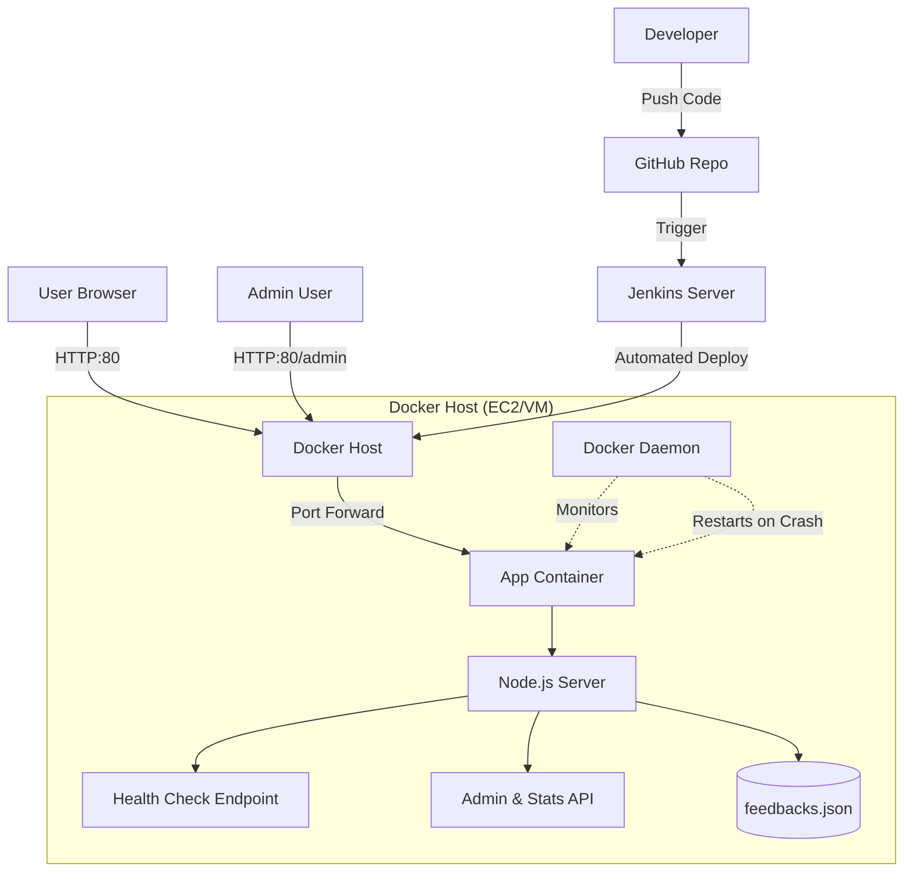

# System Architecture

## Overview
This project implements a **Self-Healing Web Application** utilizing modern DevOps practices. The architecture is designed to be resilient, automated, and easily scalable.

## Components

### 1. Web Application Layer
- **Tech Stack**: Node.js, Express.js
- **Function**: Handles HTTP requests, processes form submissions, and serves the frontend.
- **Key Features**:
  - `/health` endpoint for status monitoring.
  - `/crash` endpoint to simulate failure for demonstration.

### 2. Containerization Layer
- **Tool**: Docker
- **Function**: Encapsulates the application and its dependencies into a reliable, portable unit (Image).
- **Configuration**:
  - Base Image: `node:18-alpine` (Small footprint, secure).
  - Port Mapping: Maps host port 80 to container port 3000.

### 3. Orchestration & Self-Healing
- **Tool**: Docker Compose & Docker Daemon
- **Mechanism**:
  - **Restart Policy**: `restart: always`. If the application process exits (crashes), the Docker daemon immediately restarts the container.
  - **Health Checks**: Docker periodically pings `http://localhost:3000/health`. If it fails, the container is marked unhealthy, triggering predefined recovery actions (if configured with advanced orchestrators like Swarm/K8s) or simple restarts via policies.

### 4. Admin & Management Layer
- **Interface**: Secure `/admin` dashboard.
- **Function**: Allows monitoring live stats (uptime, traffic) and managing user feedback entries.
- **Security**: Protected via `ADMIN_PASSWORD` environment variable.

### 5. Persistent Storage Layer
- **Storage**: `app/data/feedbacks.json`
- **Function**: Stores user entries locally. Mapped as a Docker volume for persistence across container lifecycle events.

## CI/CD Pipeline
- **Tool**: Jenkins
- **Flow**:
  1.  **Source**: Developer pushes code to GitHub.
  2.  **Build**: Jenkins pulls code and installs dependencies.
  3.  **Test**: Runs unit tests (`npm test`).
  4.  **Package**: Builds a new Docker image.
  5.  **Deploy**: Deploys the new image with volume mounting for data persistence.

## Diagram

